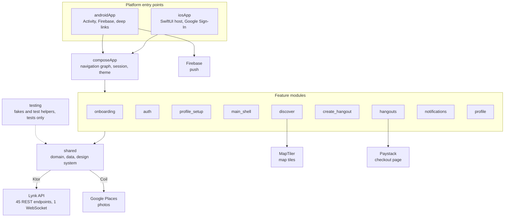
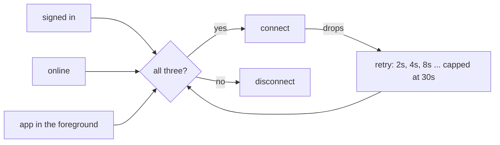
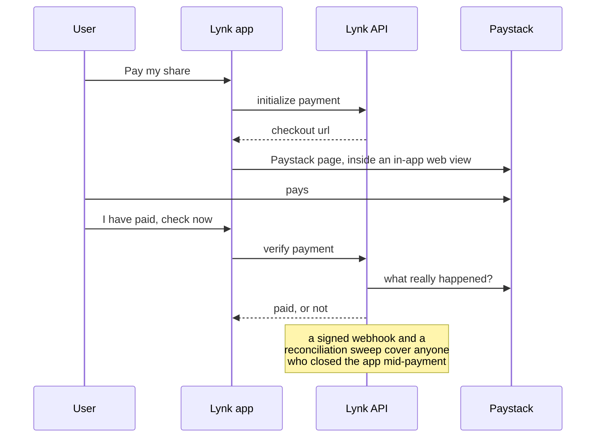
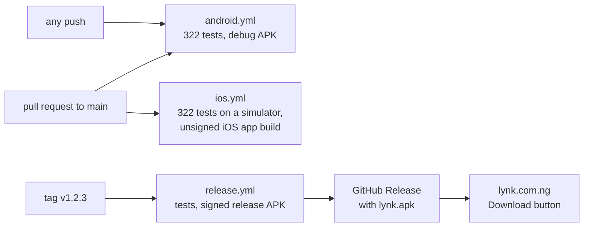

# Lynk

Stop arguing in the group chat. Just Lynk.

Friends create a hangout, invite their squad, vote on a spot everyone can reach, split the bill, and show up. This is
the app: one **Kotlin Multiplatform** codebase, with the UI written once in **Compose Multiplatform**, running natively on
Android and iOS against a live Spring Boot backend.

**Download:** [lynk.apk](https://github.com/EEseka/Lynk/releases/latest/download/lynk.apk) ·
**Website:** https://lynk.com.ng · **Backend:** [Lynk API](https://github.com/EEseka/lynk-api) ·
**Site source:** [Lynk Web](https://github.com/EEseka/lynk-web)

[](https://github.com/EEseka/Lynk/actions/workflows/android.yml)
[](https://github.com/EEseka/Lynk/actions/workflows/ios.yml)
[](https://github.com/EEseka/Lynk/actions/workflows/release.yml)
[](https://github.com/EEseka/Lynk/releases/latest)

---

<!-- Screenshots and a demo reel go here once the first hangouts have run with real friends. -->

## What it does

|                   |                                                                                                                          |
|-------------------|--------------------------------------------------------------------------------------------------------------------------|
| **Sign in**       | Google Sign-In or a guest account, then a profile with a live username availability check and an optional photo          |
| **Discover**      | A map of trending spots near you, search, a price filter, and saved spots, with real photos from Google Places           |
| **Hangouts**      | Create one in two steps, invite friends by username, RSVP, edit, cancel, and filter your list by status                  |
| **Live lobby**    | Propose spots, vote in real time, see who is in the room, and let the host break a tie                                   |
| **Payments**      | The host turns on bill-splitting, everyone pays their share through Paystack inside the app, the host gets paid out      |
| **Notifications** | Push notifications, an inbox with an unread badge, and invite previews you can accept or decline from the notification   |
| **Profile**       | Edit your profile, saved spots, light and dark theme, push settings, account deletion that refuses to strand money       |

It adapts to the screen: a bottom bar on phones, a navigation rail and a side-by-side hangout list and detail on tablets
and foldables, bottom sheets on phones and dialogs on wide screens.

## Architecture



A feature depends on another only to embed one of its screens: `main_shell` hosts the Discover, Hangouts and Profile
tabs, `discover` and `hangouts` open the `create_hangout` sheet, and `hangouts` shows the notifications inbox. Logic two
features share always lives in `shared`.

Every screen follows the same **MVI** shape: an immutable `State`, `Action`s in, one-off `Event`s out, a `Root`
composable that wires the ViewModel and a `Screen` composable that only draws. Data flows through interfaces declared in
`shared/domain` and implemented in `shared/data`, so no ViewModel ever touches Ktor, DataStore or a platform API.

### Modules

```
androidApp       Android entry point: MainActivity, Firebase messaging, release signing
iosApp           iOS entry point: SwiftUI host, Google Sign-In
composeApp       the app itself: navigation graph, session, theme and first-run state
shared           domain models and interfaces, Ktor services, the lobby WebSocket, DataStore,
                 design system, deep links, date and money formatting,
                 platform code (location, media, permissions)
testing          one fake per shared interface plus test helpers; only ever a test dependency

feature/
  onboarding     first-run introduction
  auth           Google and guest sign-in
  profile_setup  username, display name and photo for a new account
  main_shell     tab navigation and the unread notification badge
  discover       map, trending spots, search, saved spots
  create_hangout the two-step create sheet
  hangouts       hangout list, detail, live voting, payments
  notifications  inbox and invite previews
  profile        profile, settings, saved spots
```

### The live lobby

The lobby is a raw WebSocket carrying a small JSON envelope, not STOMP. The connection is not left to chance: it opens
only when all three of these hold, and closes the moment one stops holding.



Nineteen event types arrive over it: presence, proposals, votes, ties, RSVPs, payments and host actions. A frame that
cannot be read is logged and skipped rather than tearing the connection down. On iOS, both shapes a timeout can take
through Ktor's Darwin engine are treated as retriable, so a flaky network recovers on both platforms.

### Paying for a share

The app never tells the server that it paid. The server asks Paystack.



The checkout sheet cannot be swiped away while a payment is open, so nobody abandons a charge by accident.

### Things worth a closer look

**One screen, three ViewModels.** Hangout detail is split by domain: `HangoutDetailViewModel` for the hangout itself,
`HangoutVotingViewModel` for the lobby, and `HangoutPaymentsViewModel` for money. They share one in-memory
`HangoutDetailRepository` in `shared`, so an update from any of them reaches the other two without passing data through
the UI. Switching hangouts resets all three, which closed a bug where a half-filled payment form could carry one
hangout's total into another's setup.

**Map markers are Compose, not map layers.** MapLibre draws the map; every marker is an ordinary composable positioned on
top of it. Animating a map layer's properties is unreliable, so markers animate like any other composable and use the
same design system as the rest of the app.

**Spot photos prove who is asking.** Google Places keys are restricted to Lynk's package and signing certificate. The
app reads the certificate of the key that actually signed the installed build and sends its fingerprint, so debug,
release and Play Store builds each identify themselves correctly with no configuration.

**Native where it matters.** On iOS the top bar, tab bar, buttons, switches, sliders, segmented controls, menus, date
and time pickers, dialogs, action sheets and the Paystack web view are real UIKit controls, through Calf. Haptics follow
one token per kind of interaction, and layouts avoid fixed heights so they grow with the system font size.

**What was deliberately left out.** The original plan had STOMP, PostGIS, Paging 3, Redis pub/sub and ratings. The app
ships a raw WebSocket, Google Places instead of an own spatial database, a small custom `Paginator`, a single backend
instance, and private hangouts with no ratings. Each cut removed a dependency without removing a feature anyone uses.

## Tech

**Kotlin 2.4** · **Compose Multiplatform 1.12** · Material 3 with adaptive layouts · Koin · Ktor (OkHttp and Darwin) ·
kotlinx.serialization · kotlinx.coroutines · DataStore · Coil 3 · MapLibre Compose with MapTiler tiles · Google Places ·
KMPAuth (Google Sign-In) · Calf · moko-permissions · moko-geo · Firebase Cloud Messaging · Kermit · Compottie · Lucide
icons · BuildKonfig · Turbine · AssertK · GitHub Actions

## Testing

**322 tests**, all in `commonTest`, so the same test code runs on the **JVM** and on the **iOS simulator**.

```
hangouts          101   detail, lobby voting, payments, list, list-detail
shared             57   stores, paginator, unread counter, mappers, date and money formatting, validators
create_hangout     52   the two-step flow and its validators
profile            32   profile, settings, saved spots
notifications      22   inbox and invite previews
profile_setup      18   username checks, photo upload, submission
discover           12   trending, search, filters, saving spots
composeApp         11   session, theme and first-run state
auth                9   Google and guest sign-in
main_shell          6   tabs and the unread badge
onboarding          2   first run
```

Every ViewModel is tested against every one of its actions, plus the logic that sits outside ViewModels: validators,
mappers, the lobby store, the paginator and the payment amount field. Each `shared` interface has exactly one fake, in
the `testing` module, and every feature uses the same fakes.

Writing them found three real bugs, all fixed:

- a profile photo that failed to upload still saved the profile and reported success, because a decision read
  `state.value` on the line after updating it and got the old value
- Save re-enabled itself right after a successful save
- Complete Profile wiped the "username is taken" message and then refused to submit without saying why

There are no Compose UI tests on purpose. The ones that existed only checked that a button was enabled, which the
ViewModel tests already prove, and they needed Robolectric just to run on Android. The UI is verified on real devices.

```bash
./gradlew testAndroidHostTest       # all 322 on the JVM
./gradlew iosSimulatorArm64Test     # all 322 on an iOS simulator (macOS only)
```

## CI and releases



|               |                                                                                                   |
|---------------|---------------------------------------------------------------------------------------------------|
| `android.yml` | every push and pull request: all tests on the JVM, then a debug APK kept for seven days           |
| `ios.yml`     | pull requests into `main` and on demand: all tests on an iOS simulator, then an unsigned app build |
| `release.yml` | a `v*` tag: tests, then a signed, R8-shrunk APK published to a GitHub Release as `lynk.apk`        |

The release APK is always named `lynk.apk`, because the website's Download button links to
`releases/latest/download/lynk.apk`. The signing key never enters the repository: it reaches CI as an encrypted secret
and is rebuilt into a file only for the length of the job.

## Running it

Needs **JDK 21** and **Android Studio**. The iOS app also needs **macOS** and **Xcode**.

```bash
git clone https://github.com/EEseka/Lynk.git && cd Lynk
./gradlew :androidApp:assembleDebug
```

For iOS, open `iosApp/iosApp.xcodeproj` in Xcode and run the `iosApp` scheme.

The app talks to the production API at `api.lynk.com.ng`, so it needs real keys to do anything useful.

### Configuration

Secrets go in `local.properties`, which git ignores. On CI the same names arrive as environment variables.

|                                                                                         |                                                   |
|-----------------------------------------------------------------------------------------|---------------------------------------------------|
| `API_KEY`                                                                               | the key Lynk API expects on every request         |
| `WEB_CLIENT_ID`                                                                         | Google Sign-In                                    |
| `MAP_TILER_API_KEY`                                                                     | map tiles                                         |
| `GOOGLE_PLACES_ANDROID_API_KEY` `GOOGLE_PLACES_IOS_API_KEY`                             | spot photos                                       |
| `IS_DEBUG`                                                                              | optional; `true` logs every HTTP call             |
| `RELEASE_STORE_FILE` `RELEASE_STORE_PASSWORD` `RELEASE_KEY_ALIAS` `RELEASE_KEY_PASSWORD` | release builds only                               |

Firebase needs `androidApp/google-services.json`, also ignored by git.

## Installing the APK

1. On your Android phone, open [lynk.com.ng](https://lynk.com.ng) or the
   [latest release](https://github.com/EEseka/Lynk/releases/latest) and download `lynk.apk`.
2. Open it. Android asks once to allow installs from your browser; allow it.
3. Needs Android 7.0 or newer.

## Status

Android is released as a direct download. The iOS app builds and runs on a real iPhone; push notifications and the App
Store release wait on an Apple Developer account. Google Play comes next.

## License

All rights reserved. The code is public to read, but not licensed for use. See [LICENSE](LICENSE).
